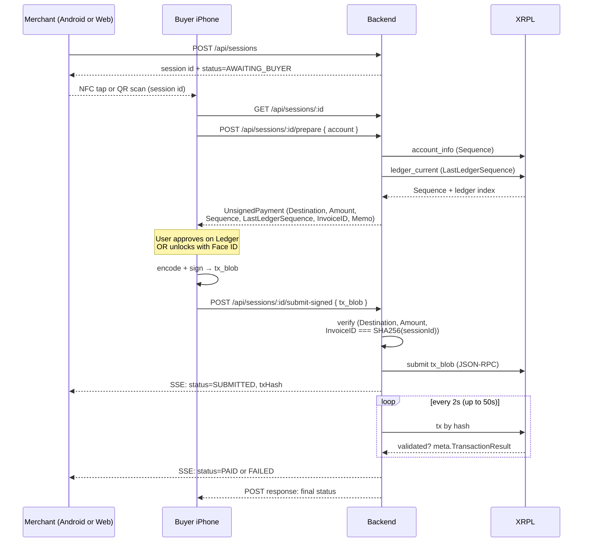

# RipPay

**Self-custody, in-person XRPL checkout — tap, sign with a Ledger Nano X or Face ID, settle on XRPL in under five seconds.**


[](https://testnet.xrpl.org)
[](https://testnet.xrpl.org/transactions/A9BEDB276F0A725DE326B90BA582BC59F7F238B00903E2EECFE730E1F2706BF1)

RipPay is a working in-person XRP checkout built around two real native mobile apps we installed on our own phones. The merchant runs our **native Android HCE app**; the buyer runs our **native iPhone app** and signs with a **Ledger Nano X over BLE** or with **Face ID** gating an on-device `xrpl.Wallet`. The two phones meet over NFC at the counter, the signed Payment settles on XRPL in ~3–5 seconds, and the transaction is cryptographically bound to the checkout session via `InvoiceID`. No custodian. No browser extension. No seed-phrase-on-a-napkin ceremony.

> **Brand note.** The GitHub repo is `coldtap/` and a handful of internal identifiers (`com.coldtap.hce` Android package, `coldtap://` URL scheme, Xcode project `ColdTap`) are preserved across an in-flight rebrand to **RipPay**. They stay put because renaming them mid-demo invalidates signing identity and provisioning profiles. Everything user-facing is RipPay.

---

## Table of contents

- [Why XRPL was the right substrate](#why-xrpl-was-the-right-substrate)
- [The flow in 30 seconds](#the-flow-in-30-seconds)
- [XRPL integration](#xrpl-integration)
  - [Primitives we use, and where](#primitives-we-use-and-where)
  - [Transaction lifecycle](#transaction-lifecycle)
  - [Replay-attack prevention via InvoiceID](#replay-attack-prevention-via-invoiceid)
  - [Two signing paths](#two-signing-paths)
  - [Network handling and the JSON-RPC choice](#network-handling-and-the-json-rpc-choice)
- [Architecture](#architecture)
  - [System diagram](#system-diagram)
  - [Payment lifecycle](#payment-lifecycle)
  - [Repo layout](#repo-layout)
- [The apps we built](#the-apps-we-built)
- [Roadmap — what would unlock more XRPL surface area](#roadmap--what-would-unlock-more-xrpl-surface-area)
- [Hackathon feedback](#hackathon-feedback)
- [Links](#links)

---

## Why XRPL was the right substrate

We started this looking for a chain where in-person payments are actually viable. Most aren't: fees are too high for a $4 coffee, finality is too slow to hand someone their order, or the "wallet" story is a browser extension and a seed phrase on a napkin. XRPL hit five things at once:

| What POS needs | What XRPL gives | Why it matters for RipPay |
|---|---|---|
| **Sub-10-second finality** | 3–5s validator-confirmed ledger close | Merchant doesn't hold the order while a tx is "pending." |
| **Sub-cent fees** | ~12 drops ≈ $0.0001 at demo rates | A $1.00 coffee actually pays for itself. |
| **Deterministic expiry** | Native `LastLedgerSequence` field | We set a ~50-second validity window and know *exactly* when a signed blob is dead. No "stuck pending" pathology. |
| **Native order-binding** | `InvoiceID` + `Memo` fields | A signed blob is bound on-ledger to the session — we don't need an off-chain correlation table or a database lookup to trust what was paid. |
| **Real hardware-wallet support** | Mature `@ledgerhq/hw-app-xrp`, BIP44 path `44'/144'/0'/0/0` | Judges can watch a Ledger Nano X physically sign in-person. |

XRPL is also the only major L1 we found where the native schema understood "this payment is for this order" without a smart-contract detour. That's the foundation of our replay-prevention story below, and it meant we didn't have to ship a custom contract to call ourselves a secure merchant rail.

---

## The flow in 30 seconds

```
 Merchant Android (HCE app)     Buyer iPhone (RipPay app)      Ledger Nano X / iOS Keychain
 ──────────────────────────     ──────────────────────────     ────────────────────────────
 create session  ───▶ POST /api/sessions
 idles as NFC target
          buyer taps       NFC payload = "SESSION:<id>" (20 bytes)
                       ◀────────────────────────────────◀
                           opens RipPay app
                           POST /prepare  ────▶ backend builds unsigned Payment,
                                                  autofills Sequence + LastLedgerSequence
                           ◀── unsignedTx (with InvoiceID = SHA256(sessionId))
                           signs ─────────▶ Ledger (BLE) or Face ID (Keychain)
                           ◀── tx_blob ────
                           POST /submit-signed
                                                ▶ verify Destination/Amount/InvoiceID
                                                ▶ submit via JSON-RPC to rippled
                                                ▶ poll tx until validated
                                                ▶ write PAID to session store
 Merchant Android flips to PAID (live via SSE)
```

The flow above is our primary product path — phone-to-phone NFC with on-device hardware or biometric signing. See [`DEMO.md`](./DEMO.md) for the step-by-step rehearsal runbook.

---

## XRPL integration

### Primitives we use, and where

| XRPL primitive | How RipPay uses it | Code |
|---|---|---|
| `Payment` transaction | Every checkout is a native XRP Payment. No IOUs, no smart contracts. | [`server/xrpl/prepare.ts`](apps/web/src/server/xrpl/prepare.ts), [`ios/src/ledger/TransactionBuilder.ts`](apps/ios/src/ledger/TransactionBuilder.ts) |
| `InvoiceID` | SHA256 hash of the session id, 32 bytes, hex-encoded. The server rejects any submission whose InvoiceID doesn't match the session being paid for. | [`server/invoice.ts`](apps/web/src/server/invoice.ts), [`server/xrpl/verify.ts`](apps/web/src/server/xrpl/verify.ts) |
| `Memo` (MemoType / MemoData / MemoFormat) | Human-readable session id surfaced on explorers for debugging. We don't trust the memo for identity — that's InvoiceID's job — but it helps operators trace payments. | [`server/invoice.ts`](apps/web/src/server/invoice.ts), [`ios/src/ledger/TransactionBuilder.ts`](apps/ios/src/ledger/TransactionBuilder.ts) |
| `Sequence` | Server autofills from `account_info` before returning the unsigned Payment. | [`server/xrpl/prepare.ts`](apps/web/src/server/xrpl/prepare.ts) |
| `LastLedgerSequence` | Server sets to `current + 40` (~50s validity). Clamps the replay window, kills the "stuck pending" UX. | [`server/xrpl/prepare.ts`](apps/web/src/server/xrpl/prepare.ts) |
| `Fee` | 12 drops (reference is 10; 12 gives headroom). Env-overridable. | [`server/config.ts`](apps/web/src/server/config.ts) |
| `Destination` | Merchant XRPL `r…` address, validated on both ends with `isValidClassicAddress`. | [`ios/src/ledger/TransactionBuilder.ts:22`](apps/ios/src/ledger/TransactionBuilder.ts), [`api/sessions/route.ts`](apps/web/src/app/api/sessions/route.ts) |
| `SigningPubKey` | Injected by the iPhone (from Ledger or xrpl.Wallet) into the unsigned tx before encoding. Canonical uppercase hex. | [`ios/src/ledger/TransactionBuilder.ts:41`](apps/ios/src/ledger/TransactionBuilder.ts) |
| `TxnSignature` | DER-encoded secp256k1/ed25519 signature from Ledger or xrpl.Wallet. | [`server/xrpl/verify.ts:55`](apps/web/src/server/xrpl/verify.ts) |
| JSON-RPC `submit`, `tx`, `account_info`, `ledger_current` | We use all four against rippled. | [`server/xrpl/submit.ts`](apps/web/src/server/xrpl/submit.ts), [`server/xrpl/prepare.ts`](apps/web/src/server/xrpl/prepare.ts) |
| `xrpl.js` | Used server-side for `encode`/`decode`/`hashes.hashSignedTx`/`Client`, and client-side (iOS) for `Wallet.fromSeed`, `encode`, `isValidClassicAddress`. | throughout |
| `@ledgerhq/hw-app-xrp` + `@ledgerhq/hw-transport-web-ble` | BLE transport to the Nano X for both iOS (React Native BLE) and web (Chrome WebBluetooth). | [`ios/src/ledger/XrplSigner.ts`](apps/ios/src/ledger/XrplSigner.ts), [`web/src/lib/ledger.ts`](apps/web/src/lib/ledger.ts) |

### Transaction lifecycle

```
 Client                              Backend                        XRPL network
 ──────                              ───────                        ────────────
 POST /prepare ───────────────────▶ buildUnsignedPayment()
                                     ├─ account_info → Sequence   ◀──▶ rippled (WS)
                                     ├─ ledger_current → offset   ◀──▶ rippled (WS)
                                     └─ InvoiceID = SHA256(id)
                    ◀───── unsigned Payment JSON ────

 [sign locally or over BLE — see next section]

 POST /submit-signed ─────────────▶ verifySignedBlob()
                                     ├─ decode(tx_blob)
                                     ├─ Destination match?
                                     ├─ Amount match?
                                     ├─ InvoiceID match?
                                     └─ TxnSignature present?
                                     ▼
                                    hashSignedTx(tx_blob)
                                    markSubmitted(hash)
                                    ▼
                                    submit via JSON-RPC ──────────▶ rippled
                                    ◀── engine_result (provisional)
                                    ▼
                                    after(): poll `tx` every 2s, up to 50s
                                     └─ until validated=true, then PAID
 SSE ◀──── merchant dashboard flips to PAID
```

**Why it's built this way:**

- **Backend is authoritative for everything except the signature.** Destination, Amount, InvoiceID, Fee, Sequence, LastLedgerSequence are all set by the server. The buyer phone never has an opportunity to redirect funds or change the amount.
- **Verification happens server-side before anything touches the network.** A tampered blob is rejected at [`submit-signed/route.ts`](apps/web/src/app/api/sessions/[id]/submit-signed/route.ts) before we pay a fee. Reason strings are propagated back to the buyer so they see the real error, not a delayed SSE-only failure.
- **Validation polling uses Vercel's `after()` hook.** The route returns 200 immediately after submission succeeds; the validation loop runs in a background continuation for up to 60s. The iPhone sees SSE updates (`SUBMITTED` → `VALIDATING` → `PAID`) without a long-held HTTP connection.

### Replay-attack prevention via InvoiceID

XRPL gives us a native 256-bit field called `InvoiceID` that rides along with every Payment. We set it to `SHA256(sessionId).toUpperCase()` in [`server/invoice.ts:19`](apps/web/src/server/invoice.ts). On the way back in, [`server/xrpl/verify.ts:83`](apps/web/src/server/xrpl/verify.ts) recomputes the expected InvoiceID from the session record and rejects the submission unless it matches.

What this buys us:

- **A signed blob is bound to exactly one session.** It cannot be replayed against a different checkout, because a different sessionId produces a different InvoiceID, and the server recomputes from the session id in the URL path.
- **No off-chain correlation table.** The binding is on-ledger, in the canonical XRPL primitive, visible on `testnet.xrpl.org` or any explorer.
- **Explorer debuggability.** We also attach a `Memo` with the raw session id hex-encoded, so an operator can see at a glance which checkout a given transaction belongs to. The memo is *not* part of the trust chain — InvoiceID is.

### Two signing paths

We ship both because the hackathon rubric values "real-world problem" solutions, and 99% of buyers don't own a Nano X. So:

**Ledger Nano X (marquee, default)** — [`ios/src/signing/LedgerSigner.ts`](apps/ios/src/signing/LedgerSigner.ts), [`web/src/lib/ledger.ts`](apps/web/src/lib/ledger.ts)

- Transports: React Native BLE on iOS, WebBluetooth in Chrome on Android.
- `@ledgerhq/hw-app-xrp` at BIP44 `44'/144'/0'/0/0` (standard XRP path — same as Ledger Live).
- The Ledger physically displays Destination and Amount. The user presses both buttons to confirm. Private key literally never leaves the device.
- **Prewarm optimization** — [`ios/src/hooks/useLedgerPrewarm.ts`](apps/ios/src/hooks/useLedgerPrewarm.ts): we open the BLE transport *during* Checkout so by the time the user taps Approve, the ~3–5s handshake has already happened.

**On-device xrpl.Wallet (opt-in)** — [`ios/src/signing/LocalSigner.ts`](apps/ios/src/signing/LocalSigner.ts)

- User pastes an XRPL family seed once; we validate with `Wallet.fromSeed` and store the seed in the iOS Keychain with `BIOMETRY_CURRENT_SET_OR_DEVICE_PASSCODE` access control and `WHEN_UNLOCKED_THIS_DEVICE_ONLY` accessibility.
- Every signature triggers a Face ID prompt. Seed never leaves the device; signing runs in-process via `wallet.sign(payment)`.
- The abstract `Signer` interface ([`ios/src/signing/Signer.ts`](apps/ios/src/signing/Signer.ts)) makes both paths interchangeable — ProcessingScreen just calls `prepare()` → `sign()` → `cleanup()` and the rest of the app doesn't know which backend ran.

### Network handling and the JSON-RPC choice

Configurable via env ([`server/config.ts`](apps/web/src/server/config.ts)):

- `XRPL_MODE=mock` — default; fake `SUBMITTED` → `VALIDATING` → `PAID` progression for offline demos
- `XRPL_MODE=real` + `XRPL_NETWORK=testnet` — what's deployed
- `XRPL_MODE=real` + `XRPL_NETWORK=mainnet` — supported; not in the current demo config

We use both transports deliberately:

- **WebSocket** (`xrpl.Client`) for `/prepare` — opens, reads `account_info` + `ledger_current`, disconnects. One round-trip, one connection.
- **HTTP JSON-RPC** for `/submit-signed` — Vercel Lambda workers freeze between invocations, which silently kills long-lived WebSockets and surfaces as "WebSocket is closed" on the second `request()`. HTTP is stateless and reliable. See the comment block in [`submit.ts:1–16`](apps/web/src/server/xrpl/submit.ts) for the full rationale.

---

## Architecture

### System diagram


### Payment lifecycle



### Repo layout

```
coldtap/                                 # repo root (dir kept legacy)
├── apps/
│   ├── ios/          React Native buyer app — Ledger BLE, on-device signing,
│   │                 NFC reader, deep links, merchant-landing flow
│   ├── web/          Next.js 15 — merchant dashboard, backend API, SSE,
│   │                 browser-based Ledger flow (WebBluetooth)
│   └── android/      Kotlin HCE app — merchant NFC target + receipt view
├── packages/
│   └── shared/       Session types, API contract, status enum
├── DEMO.md           Demo runbook (three flows, per-flow pre-flight checklists)
└── README.md         You are here.
```

**Inter-app contract.** All three apps talk to the web backend over HTTP and receive live updates over SSE. The canonical types live in [`packages/shared/src/session.ts`](packages/shared/src/session.ts). Neither the iOS app nor the Android app know about each other — they only know the session id and the backend URL. The merchant Android app is a **pure NFC target**: it carries only `SESSION:<id>` (20 bytes). The actual XRPL work happens on the buyer's phone and the backend.

**Why three native-ish apps.** Each picks the platform that best fits its role:
- iOS for the buyer — Ledger BLE is most mature on CoreBluetooth via React Native; iOS Secure Element + Face ID give the strongest Keychain guarantees; NFC ISO-7816 reader mode is a first-party iOS API.
- Android for the merchant NFC — Host Card Emulation (HCE) is Android-only.
- Web for the dashboard + fallback buyer — merchants want a browser-first dashboard; WebBluetooth+Ledger in Chrome covers buyers without a native app.

---

## The apps we built

**RipPay is two real, installed native mobile apps — not a browser simulation.** The sample transaction linked at the top of this README ([`A9BEDB…06BF1`](https://testnet.xrpl.org/transactions/A9BEDB276F0A725DE326B90BA582BC59F7F238B00903E2EECFE730E1F2706BF1)) was produced by the physical pair described below, tapping each other across a table, with a Ledger Nano X paired to the iPhone.

### 🍎 iPhone buyer app — React Native

Lives on our iPhone, built against [`apps/ios/`](apps/ios/) with Xcode and CocoaPods, signed with a personal provisioning profile, launched the normal way from the home screen.

- **Two signing backends**, picked in Settings:
  - **Ledger Nano X over BLE** — [`@ledgerhq/hw-app-xrp`](https://www.npmjs.com/package/@ledgerhq/hw-app-xrp) at BIP44 `44'/144'/0'/0/0`, the standard XRP path. See [`apps/ios/src/signing/LedgerSigner.ts`](apps/ios/src/signing/LedgerSigner.ts).
  - **On-device `xrpl.Wallet`** — family seed stored in iOS Keychain with `BIOMETRY_CURRENT_SET_OR_DEVICE_PASSCODE` + `WHEN_UNLOCKED_THIS_DEVICE_ONLY`. Every sign prompts Face ID. See [`apps/ios/src/signing/LocalSigner.ts`](apps/ios/src/signing/LocalSigner.ts).
- **NFC ISO-7816 reader mode** for tapping the merchant's Android — native iOS API via [`apps/ios/src/nfc/`](apps/ios/src/nfc).
- **Universal links** — tapping a `coldtap-web.vercel.app/s/:id` URL opens the buyer app directly at the pay screen.
- **Prewarmed Ledger transport** — the BLE handshake runs during checkout-screen mount so the ~3–5s pairing cost is hidden from the critical path. See [`apps/ios/src/hooks/useLedgerPrewarm.ts`](apps/ios/src/hooks/useLedgerPrewarm.ts).

### 🤖 Android merchant app — native Kotlin HCE

Lives on our Android phone, built against [`apps/android/`](apps/android/) with Android Studio + Gradle, installed as a debuggable APK, set as the device's preferred HCE payment service.

- **Host Card Emulation service** registered under AID `F0434F4C44544150` — when the buyer's iPhone taps, the Android OS routes the SELECT APDU to our [`ColdTapApduService`](apps/android/app/src/main/java/com/coldtap/hce/ColdTapApduService.kt), which responds with `SESSION:<id>` and a success status.
- **Merchant-side UI** for creating a session, picking an item, and watching the session flip to PAID via the same SSE stream the web dashboard uses.
- **Standalone Kotlin project** — not a React Native `android/` folder, not shared code with the iOS app. Separate Gradle build, separate signing identity. (That's why the repo has `apps/ios/` and `apps/android/` as sibling top-level apps.)

### What the web app is for

[`apps/web/`](apps/web/) is the merchant dashboard + backend. It's a real Next.js app deployed to Vercel ([`coldtap-web.vercel.app`](https://coldtap-web.vercel.app)) — it serves the API both mobile apps hit, hosts the merchant-side live view over SSE, and provides a browser fallback for buyers without the iOS app. The mobile apps are the primary product; the web app is the connective tissue.

### Running it yourself

If you're reproducing the build locally, each app has its own README: [`apps/ios/README.md`](apps/ios/README.md), [`apps/android/README.md`](apps/android/README.md), [`apps/web/README.md`](apps/web/README.md). The iOS and Android apps both require physical devices (no simulators — BLE and HCE don't exist in emulators).

---

## Roadmap — what would unlock more XRPL surface area

RipPay today uses the core Payment pathway deeply, but there's more XRPL we could pull in for a production merchant product. In rough order of hackathon-adjacency:

- **RLUSD settlement rail** — for merchants who want to price in USD and receive USD. The backend already accepts fiat-priced sessions (see `Session.fiatAmount` in [`session.ts:39`](packages/shared/src/session.ts)) but settles in XRP. Swapping to an `IssuedCurrencyAmount` with RLUSD as the issuer is a one-field change in `prepare.ts` plus a small update to `verify.ts`.
- **Batch transactions** — for multi-item carts. A single signed batch is cleaner UX than N Payments and lets the merchant dashboard show one atomic receipt.
- **Escrow** — for refundable deposits. `EscrowCreate` + `EscrowFinish` would let a merchant hold a deposit until service delivery without the funds leaving XRPL custody.
- **Multi-signature merchant accounts** — `SignerListSet`. Lets a merchant require two-of-three signers (owner + accountant + backend) for payouts out of the account.
- **Token-gated merchants** — NFT or MPT ownership requirement to unlock premium-price tiers.
- **Devnet AMM integration** — swap XRP for a stablecoin at the moment of checkout so buyers can pay in any on-XRPL asset.

---

## Hackathon feedback

Per the rubric's request:

**What worked.** The MCP tooling was genuinely useful — pointing an agent at the backend's `server/xrpl/` modules and asking "where should RLUSD go?" produced an answer that lined up with what we'd have done manually, faster. The XRPL docs at [xrpl.org](https://xrpl.org) are searchable and the primitive definitions (especially `InvoiceID`, `LastLedgerSequence`, `Memo`) are unambiguous in a way that other chains' specs aren't — we never had to reverse-engineer what a field was supposed to do. The testnet faucet + `testnet.xrpl.org` explorer is a clean demo loop.

**What didn't.** The xrpl.js SDK has a few rough edges in a React Native runtime: `Client` wants WebSocket, which works but isn't serverless-friendly, so we ended up writing a ~30-line JSON-RPC helper to avoid it on Vercel (see [`submit.ts:206`](apps/web/src/server/xrpl/submit.ts)). A "serverless-first" sub-SDK that's HTTP-only would save future teams this detour. The Ledger `hw-app-xrp` BLE flow on iOS was the single most time-consuming thing to make reliable — error messages are terse and the retry/reconnect story required a lot of guess-and-check.

**On SKILL.md.** It's a genuinely good pattern for constraining a language-model agent to a known-good set of operations on an unfamiliar codebase. We used it sparingly here because our codebase is small enough that the agent can map it in-context, but for a larger merchant-integration SDK we'd lean on it much harder.

**What we'd love to see.** A more opinionated, batteries-included RLUSD integration path (preconfigured issuer, auth path, trustline helper). And a first-party iOS SDK for XRPL signing — today, mobile integrators reach for React Native + xrpl.js, which requires Buffer/randomBytes polyfills, BLE transport glue, and a lot of platform-specific testing.

---

## Links

- Live demo: [`coldtap-web.vercel.app`](https://coldtap-web.vercel.app) (testnet)
- Sample paid transaction on testnet: [`A9BEDB…06BF1`](https://testnet.xrpl.org/transactions/A9BEDB276F0A725DE326B90BA582BC59F7F238B00903E2EECFE730E1F2706BF1) — a real RipPay checkout, signed by a Ledger Nano X, verified against its `InvoiceID = SHA256(sessionId)`, validated by rippled.
- Demo runbook + per-flow pre-flight: [`DEMO.md`](./DEMO.md)
- iOS buyer app details: [`apps/ios/README.md`](./apps/ios/README.md)
- Web app details: [`apps/web/README.md`](./apps/web/README.md)
- Android merchant HCE details: [`apps/android/README.md`](./apps/android/README.md)
- Shared session / API contract: [`packages/shared/src/session.ts`](./packages/shared/src/session.ts)
- Browser-Ledger real-device runbook: [`apps/web/WEB_LEDGER.md`](./apps/web/WEB_LEDGER.md)
- XRPL docs: [xrpl.org](https://xrpl.org) · Testnet faucet: [XRP faucets](https://xrpl.org/resources/dev-tools/xrp-faucets) · Testnet explorer: [testnet.xrpl.org](https://testnet.xrpl.org)
